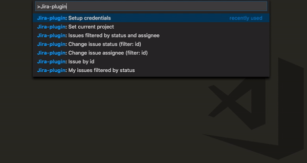
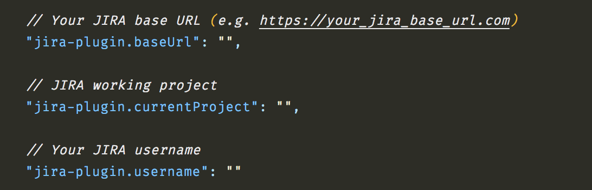
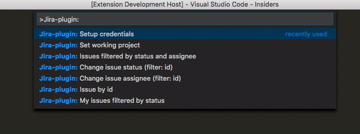

# jira-plugin README

 Inspired by [vscode-jira](https://github.com/KnisterPeter/vscode-jira) I decided to create my own JIRA plugin for VS Code.
I'm happy to will implement more features.  

## Install

ext install jira-plugin  

## Usage

From the command palette Ctrl-Shift-P (Windows, Linux) or Cmd-Shift-P (OSX) under <b>Jira-plugin</b> you have all the extension commands.  

## Setup

First of all your have to launch "Setup credentials" command to configure the plugin. 
The Jira base URL is needed and also your credentials. 
After that you have to setup the working project. ("Set working project" command)  
<b>n.b:</b> If you need to browse issues for various project you have to launch the command to perform the switch. 

## Config

The extension store credentials in VS Code settings.  
<b>n.b:</b> the extension store the password in VS Code internal storage so it's safe and hidden. :wink:  

## Features

- <b>Issue by id</b> 
  With this command you can search and view a issue by id.  
- <b>My issues filtered by status</b> 
  With this command you can search your issues with a particular status.  
- <b>Issues filtered by status and assignee</b> 
  With this command you can search issues with a particular assignee and status.  
- <b>Change issue status (filter: id)</b> 
  With this command you can change an issue status. In the filter you have to specify the id.   
- <b>Change issue assignee (filter: id)</b> 
  With this command you can change an issue assignee. In the filter you have to specify the id.  

## Resources

Based on [JIRA APIs](https://developer.atlassian.com/cloud/jira/platform/rest/)
