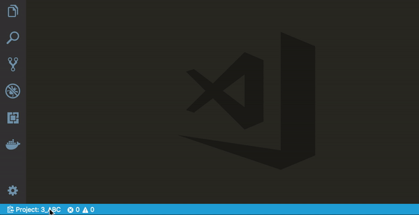
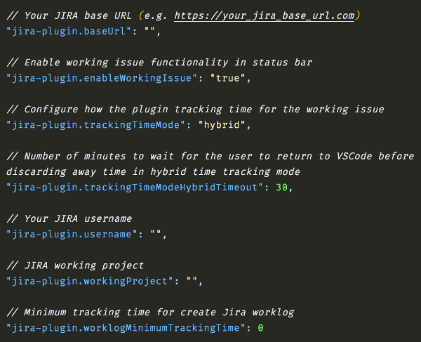
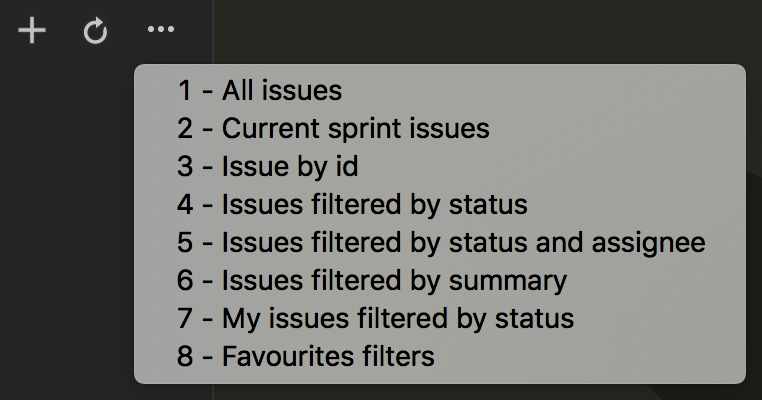
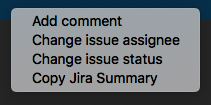
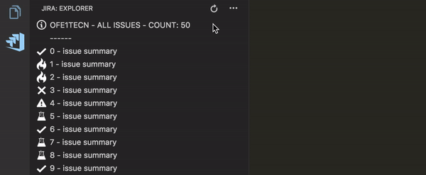
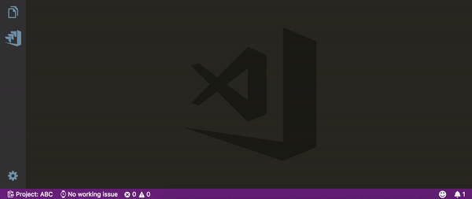

# jira-plugin README

## Installation

Launch VS Code Quick Open (Ctrl+P), paste the following command, and press enter.<br>
`ext install gioboa.jira-plugin`<br><br>

## Usage

From the command palette Ctrl-Shift-P (Windows, Linux) or Cmd-Shift-P (OSX) under **Jira-plugin** you have all the extension commands.<br><br>

## Setup

First of all your have to launch "Setup credentials" command to configure the plugin.<br>
The Jira base URL is needed and also your credentials.<br>


## Set working project

After setup you have to set the working project, you can click on status-bar icon or use "Set working project" command.<br><br>
**n.b:** If you need to browse issues for various project you have to switch the working project.<br>



## Config

The extension store credentials in VS Code settings.<br><br>
**n.b:** the extension store the password in VS Code internal storage so it's safe and hidden. :wink: <br>



**n.b:** setting: `trackingTimeMode` <br>
values:<br>

1.  `hybrid` - will increment tracking time always but if VS Code remain idle more then "trackingTimeModeHybridTimeout" will discard the time addition<br>
1.  `always` - will increment tracking time always <br>
1.  `vsCodeFocus` - will increment tracking time only if VS Code is focused<br>

## Explorer commands



- **Create new ticket**<br>
  With this command you can create new ticket.<br><br>

- **Insert Working Issue Key+Summary comment**<br>
  With this command you can insert Working Issue Key+Summary comment at the current position in the code.
  `You can set your custom keyboard shortcut to retrieve this command`<br><br>

### Filters

- **All issues**<br>
  With this command you can search all issues for the current project.<br><br>
- **Current sprint issues**<br>
  With this command you can search all issues for the current sprint.<br><br>
- **Issue by id**<br>
  With this command you can search an issue by id.<br><br>
- **Issues filtered by status**<br>
  With this command you can search issues with a particular status.<br><br>
- **Issues filtered by status and assignee**<br>
  With this command you can search issues with a particular assignee and status.<br><br>
- **Issues filtered by summary**<br>
  With this command you can search issues with a particular summary.<br><br>
- **My issues filtered by status**<br>
  With this command you can search your issues with a particular status.<br><br>
- **Favourites filters**<br>
  With this command you can use your favoutite filters for search your issues.
  `only coherent "favorites filters" for the working project`<br><br>

## Issue commands (right click on issue in explorer)



- **Add comment**<br>
  With this command you can add comment. [@] is the placeholder for tag a user.<br>**e.g:** 'This is the placeholder for tag user -> [@]'<br><br>
- **Change issue assignee**<br>
  With this command you can change an issue assignee.<br><br>
- **Change issue status**<br>
  With this command you can change an issue status.<br><br>
- **Copy Jira Key+Summary**<br>
  With this command you can copy to clipboard Jira Key+Summary.<br><br>

## Explorer

- In the explorer you can use all the extension command



## Status bar

### Working project

- The extension in the status bar show the **working project**, you can also change it from here.


### Working issue

- The extension in the status bar show the **working issue**, you can also change it from here. <br>
  With `jira-plugin.workingIssueStatues` config you can define statuses used for extract working issue list.<br>
  The extension trace the time spended on the working issue and you can also create the Jira worklog for the activity. <br>
  Jira worklog allow only time in minute so the extension round your activity time. <br>
  The extension **every 60 second** store in iternal storage the current working activity so if you close and reopen VS Code the extension retrive (if needed) the pending working issue.



## Want to contribute?

If you want to file a bug, contribute some code or improve documentation, read up on [contributing guidelines](CONTRIBUTING.md), and check out [open issues](https://github.com/gioboa/jira-plugin/issues).

## [Contributors](https://github.com/gioboa/jira-plugin/graphs/contributors)

| [<br /><sub><b>Giorgio Boa</b></sub>](https://github.com/gioboa) | [<br /><sub><b>jumpkick</b></sub>](https://github.com/jumpkick)<br /> | [<br /><sub><b>tiago-pullup</b></sub>](https://github.com/tiago-pullup)<br /> | [<br /><sub><b>MXM-7</b></sub>](https://github.com/MXM-7)<br /> | [<br /><sub><b>Diogo Paschoal</b></sub>](https://github.com/diogogeru)<br /> | [<br /><sub><b>Ian Mackie</b></sub>](https://github.com/Kaffiend)<br /> |
| :--------------------------------------------------------------------------------------------------------------------------------------------------------------------------: | :------------------------------------------------------------------------------------------------------------------------------------------------------------------------------: | :---------------------------------------------------------------------------------------------------------------------------------------------------------------------------------------: | :-------------------------------------------------------------------------------------------------------------------------------------------------------------------------: | :--------------------------------------------------------------------------------------------------------------------------------------------------------------------------------------: | ---------------------------------------------------------------------------------------------------------------------------------------------------------------------------------------- |


## License

[](https://github.com/gioboa/jira-plugin/blob/master/LICENSE)

## Versioning

`jira-plugin` will be maintained under the Semantic Versioning guidelines. Releases are numbered with the following format:

```
<MAJOR>.<MINOR>.<PATCH>
```

1.  **MAJOR** versions indicate incompatible API changes,
2.  **MINOR** versions add functionality in a backwards-compatible manner, and
3.  **PATCH** versions introduce backwards-compatible bug fixes.

For more information on SemVer, please visit [http://semver.org](http://semver.org).

## Resources

Based on [JIRA APIs](https://developer.atlassian.com/cloud/jira/platform/rest/)
