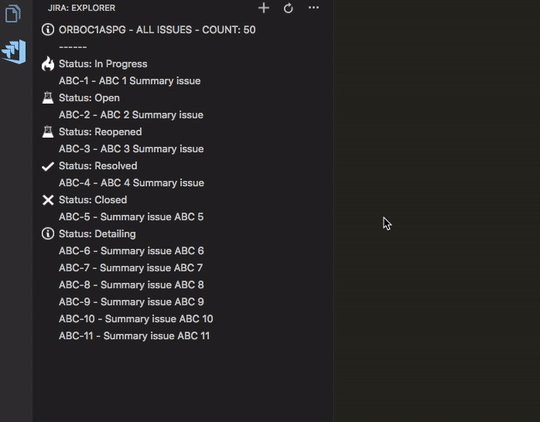
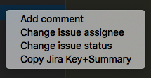
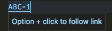

# jira-plugin README

## Key Features

- [View Jira issues](#explorer)
- Create new Jira issue
- [Search/Filter Jira issues](#filters)
  - All issues
  - Current sprint issues
  - Issue by id
  - Issues filtered by status
  - Issues filtered by status and assignee
  - Issues filtered by summary
  - My issues filtered by status
  - Favourites filters
- Open Jira issue in the browser (left click on the issue)
- Change Jira issue status
- Change Jira issue assignee
- Add comment to Jira issue
- Copy to clipboard Jira Key+Summary
- [Set current working project](#working-project)
- [Set current working issue](#working-issue)
- [Trace the time spended on the current working issue](#working-issue)
- Insert current Working Issue Key+Summary comment
- [Jira Issue Key+Summary link to open Jira issue in the browser](#link-to-open-jira-issue-in-the-browser)
- [Git Integration](#settings)

## Support

**jira-plugin** is an open source extension.<br>While being free and open source, if you find it useful, please consider supporting it by donating via PayPal.<br>**Thanks!**

<a href="https://www.paypal.com/cgi-bin/webscr?cmd=_donations&business=UANXPBHUX7DJW&item_name=Donation+for+jira-plugin.+Thanks+for+be+a+backer.&currency_code=EUR&source=url">
  
</a>

## Installation

Launch VS Code Quick Open (Ctrl+P), paste the following command, and press enter.<br>
`ext install gioboa.jira-plugin`<br><br>

## Usage

From the command palette Ctrl-Shift-P (Windows, Linux) or Cmd-Shift-P (OSX) under **Jira-plugin** you have all the extension commands.<br><br>

## Setup

First of all your have to launch "Setup credentials" command to configure the plugin.<br>
The Jira base URL is needed and also your credentials.<br>
**n.b:** you can also use OAuth.

- url: your base Atlassian url
- username: your full email
- password: the token


## Set working project

After setup you have to set the working project, you can click on status-bar icon or use "Set working project" command.<br><br>
**n.b:** If you need to browse issues for various project you have to switch the working project.<br>


## Settings

The extension store credentials in VS Code settings.<br><br>
**n.b:** the extension store the password in VS Code internal storage so it's safe and hidden. :wink: <br>

- **Additional Statuses** <br>
  Additional custom statuses, used for manage some Jira wrong behavior
- **Base Url** <br>
  Your Jira base URL (e.g. https://your_jira_base_url.com or http://your_jira_base_url.com:your_port)
- **Enable Working Issue** <br>
  Enable working issue functionality in status bar
- **Git Integration** <br>
  Automatically watch for branch switching and select appropriate project and working issue
- **Tracking Time Mode** <br>
  Configure how the plugin tracking time for the working issue
- **Tracking Time Mode Hybrid Timeout** <br>
  Number of minutes to wait for the user to return to VSCode before discarding away time in hybrid time tracking mode
- **Username** <br>
  Your Jira username or full email for OAuth
- **Working Issue Statues** <br>
  Statuses used for extract working issue list (e.g. In Progress, Development In Progress, Test in Progress)
- **Working Project** <br>
  Jira working project
- **Worklog Minimum Tracking Time** <br>
  Minimum tracking time for show the Worklog modal and create Jira worklog

**n.b:** setting: **Tracking Time Mode** <br>
values:<br>

1.  `hybrid` - will increment tracking time always but if VS Code remain idle more then "trackingTimeModeHybridTimeout" will discard the time addition<br>
1.  `always` - will increment tracking time always <br>
1.  `vsCodeFocus` - will increment tracking time only if VS Code is focused<br>

## Explorer

- In the explorer you can use all the extension command



## Explorer commands

- **Create new ticket**<br>
  With this command you can create new ticket.<br><br>

- **Insert Working Issue Key+Summary comment**<br>
  With this command you can insert Working Issue Key+Summary comment at the current position in the code.<br>
  `You can set your custom keyboard shortcut to retrieve this command`<br><br>

### Filters

- **All issues**<br>
  With this command you can search all issues for the current project.<br><br>
- **Current sprint issues**<br>
  With this command you can search all issues for the current sprint.<br><br>
- **Issue by id**<br>
  With this command you can search an issue by id.<br><br>
- **Issues filtered by status**<br>
  With this command you can search issues with a particular status.<br><br>
- **Issues filtered by status and assignee**<br>
  With this command you can search issues with a particular assignee and status.<br><br>
- **Issues filtered by summary**<br>
  With this command you can search issues with a particular summary.<br><br>
- **My issues filtered by status**<br>
  With this command you can search your issues with a particular status.<br><br>
- **Favourites filters**<br>
  With this command you can use your favoutite filters for search your issues.<br>
  `only coherent "favorites filters" for the working project`<br><br>

## Issue commands (right click on issue in explorer)



- **Add comment**<br>
  With this command you can add comment. [@] is the placeholder for tag a user.<br>**e.g:** 'This is the placeholder for tag user -> [@]'<br><br>
- **Change issue assignee**<br>
  With this command you can change an issue assignee.<br><br>
- **Change issue status**<br>
  With this command you can change an issue status.<br><br>
- **Copy Jira Key+Summary**<br>
  With this command you can copy to clipboard Jira Key+Summary.<br><br>

## Status bar

### Working project

- The extension in the status bar show the **working project**, you can also change it from here.


### Working issue

- The extension in the status bar show the **working issue**, you can also change it from here. <br>
  With **Working Issue Statues** setting you can define statuses used for extract working issue list.<br>
  The extension trace the time spended on the working issue and you can also create the Jira worklog for the activity. <br>
  Jira worklog allow only time in minute so the extension round your activity time. <br>
  The extension **every 60 second** store in iternal storage the current working activity so if you close and reopen VS Code the extension retrieve (if needed) the pending working issue.


### Link to open Jira issue in the browser



## Want to contribute?

If you want to file a bug, contribute some code or improve documentation, read up on [contributing guidelines](CONTRIBUTING.md), and check out [open issues](https://github.com/gioboa/jira-plugin/issues).

## [Contributors](https://github.com/gioboa/jira-plugin/graphs/contributors)

| [<br /><sub><b>Giorgio Boa</b></sub>](https://github.com/gioboa) | [<br /><sub><b>jumpkick</b></sub>](https://github.com/jumpkick)<br /> | [<br /><sub><b>tiago-pullup</b></sub>](https://github.com/tiago-pullup)<br /> | [<br /><sub><b>MXM-7</b></sub>](https://github.com/MXM-7)<br /> | [<br /><sub><b>Diogo Paschoal</b></sub>](https://github.com/diogogeru)<br /> | [<br /><sub><b>Ian Mackie</b></sub>](https://github.com/Kaffiend)<br /> | [<br/><sub><b>Roman Ostolosh</b></sub>](https://github.com/knicefire)<br/> | [<br/><sub><b>Keith Turley</b></sub>](https://github.com/keithturley)<br/> |
| :-----------------------------------------------------------------------------------------------------------------------------------------------: | :---------------------------------------------------------------------------------------------------------------------------------------------------: | :------------------------------------------------------------------------------------------------------------------------------------------------------------: | :----------------------------------------------------------------------------------------------------------------------------------------------: | :-----------------------------------------------------------------------------------------------------------------------------------------------------------: | ------------------------------------------------------------------------------------------------------------------------------------------------------------- | ---------------------------------------------------------------------------------------------------------------------------------------------------------------- | ----------------------------------------------------------------------------------------------------------------------------------------------------------------- |


## License

[](https://github.com/gioboa/jira-plugin/blob/master/LICENSE)

## Versioning

`jira-plugin` will be maintained under the Semantic Versioning guidelines. Releases are numbered with the following format:

```
<MAJOR>.<MINOR>.<PATCH>
```

1.  **MAJOR** versions indicate incompatible API changes,
2.  **MINOR** versions add functionality in a backwards-compatible manner, and
3.  **PATCH** versions introduce backwards-compatible bug fixes.

For more information on SemVer, please visit [http://semver.org](http://semver.org).

## Resources

Based on [Jira APIs](https://developer.atlassian.com/cloud/jira/platform/rest/)
